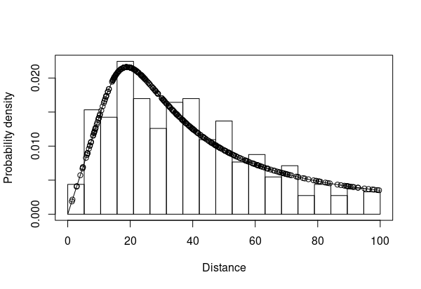
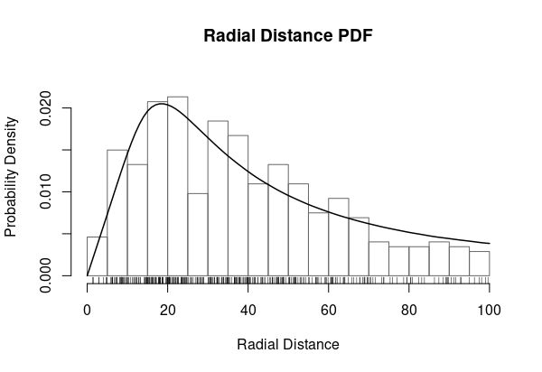
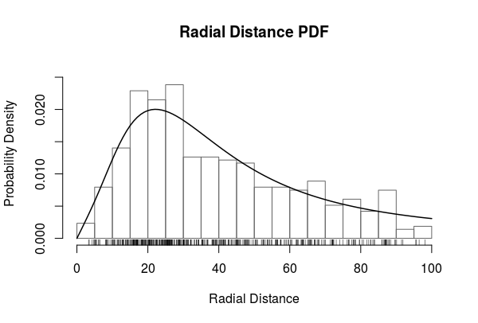

```{r setup, include = FALSE}
knitr::opts_chunk$set(
  collapse = TRUE,
  comment = "#>"
)
```

The <code>moveds</code> package implements the methods presented in [Glennie et
al. 2018](http://www.richardglennie.co.uk/files/moveds.pdf). The method can be
used estimate abundance while accounting for the movement of individuals by
Brownian motion. To do this, one requires information on the detection process
and the movement process.

In this vignette, I will take you through a point transect analysis. 

```{r load_package}
library(moveds)
```
```{r secret_data_load, echo = FALSE}
load("point_example.RData")
```
## Distance Data 

The data collected in point transect surveys provides information on the detection 
process. MDS models are two-dimensional and work in continuous-time; thus, you need 
to record the two-dimensional location of each detected individual and the time since
the beginning of the surveying the transect that each detection took place.

I load some simulated point transect data in the required format.  

```{r load_data}
data("example_mds_point")
str(example_mds_point) 
obs <- example_mds_point$obs
trans <- example_mds_point$trans
```

The object <code>obs</code> contains the records of detections made during
the point transect survey. 
```{r summary_data}
summary(obs)
nrow(obs)
```

There was `r nrow(obs)` detections made within point transects of radius $100$ 
distance units. 

Let's look at radial distances. 

```{r make_r}
distances <- sqrt(obs$x^2 + obs$y^2)
```

```{r plot_data, fig.width = 5, fig.height = 5}
hist(distances, main = "", xlab = "Radial distance")
```

The object <code>trans</code> contains the transect ID numbers and the time spent
surveying each point, termed the effort. In this simulation, all transects had
equal duration. In total, the survey consisted of `r nrow(trans)` transects.  

## Movement Data

Single sightings of an individual do not provide any information on how
individuals move. Auxiliary movement information is required. You can either
provide a fixed value for the diffusion parameter or provide movement data for
this parameter to be estimated.

What does the diffusion parameter mean? If $\sigma$ is the diffusion parameter,
then $\sigma \sqrt{\Delta t}$ can be interpreted as the distance an individual 
would travel in time $\Delta t$, in both the $x$ and $y$ directions. To be 
technically correct, $\sigma^2\Delta t$ is the mean squared displacement over
time $\Delta t$.

If you want to fix the diffusion parameter, you can simulate movement data based
on a fixed value for $\sigma$ to see if distances travelled seem reasonable for
the study species. For example, you can simulate the telemetry records from two
tagged animals where locations are recorded every fifteen minutes over a single
day where $\sigma = 1$:
```{r simulate_movement, fig.width = 5, fig.height = 5}
fixed.sigma <- 1
num.tagged <- 2 
observation.times <- seq(0, 24*60, 15)
simulated.movement.data <- SimulateMovementData(num.tagged, observation.times, fixed.sigma)
str(simulated.movement.data)
plot(simulated.movement.data[[1]][,1:2], type = "b")
plot(simulated.movement.data[[2]][,1:2], type = "b")
```

For this analysis, I use simulated tag data on ten individuals, stored
in the object <code>movedat</code>. 
```{r}
data("example_move_point")
str(movedat)
```

## 1D CDS

One-dimensional, conventional distance sampling (CDS) is the standard approach
taken when analysing point transect surveys. The method is implemented in the 
package [<code>Distance</code>](https://CRAN.R-project.org/package=Distance).

```{r load_distance}
library(Distance)
```

The <code>Distance</code> package requires the data to be set up in three
tables, see the documentation of that package for futher information or see this
simple [vignette](http://distancesampling.org/R/vignettes/ducknests.html). 
I take the survey region to have area $1000^2$ distance units.
```{r setup_cds1d_data}
region.table <- data.frame(Region.Label = 1, Area = 1000 * 1000)
sample.table <- data.frame(Sample.Label = 1:n.transects, Region.Label = 1, Effort = 1)
obs.table <- data.frame(object = 1:nrow(obs), Region.Label = 1, Sample.Label = obs[, 1])
```

You can consider several key detection function models and adjustments. For simplicity, 
I use the hazard-rate model. The data were truncated at $100$ distance units prior
to being loaded. 

```{r fit_cds1d, eval = FALSE} 
cds1d <- ds(distances,
            truncation = 100,
            transect = "point",
            key = "hr",
            adjustment = NULL,
            region.table = region.table,
            sample.table = sample.table,
            obs.table = obs.table)

```
```{r summary_cds1d}
summary(cds1d)
```

```{r save_cds1d_info, echo=FALSE}
N.cds1d <- round(as.numeric(cds1d$dht$individuals$N$Estimate),2) 
pdet.cds1d <- round(summary(cds1d)[[1]][[9]], 2) 
penc.cds1d <- round(pdet.cds1d * 100^2 * pi / 1000^2, 4) 
det.est <- round(as.numeric(exp(cds1d$ddf$ds$par)),2)
```

The estimated abundance in the region is `r N.cds1d` individuals. The 
average probability of detection inside a transect is `r pdet.cds1d`. Each transect
is $100^2\pi$ distance square units in area, so the probability of being inside a transect
in a survey area that is $1000$ by $1000$ distance units is $0.03$. It follows
that the overall probability of detection in the survey region is `r penc.cds1d`.

The estimated detection function has shape $b=$ `r det.est[1]` and scale $s=$ `r det.est[2]`. 
You can plot the estimated probability density function (PDF) corresponding to these estimated parameters.
```{r plot_cds1d, eval = FALSE}
plot(cds1d)
```


Goodness-of-fit testing is provided by the <code>Distance</code> package: 
```{r gof_cds1d, eval = FALSE}
cds1d.gof <- ds.gof(cds1d)
```
```{r god_cds1d2}
cds1d.gof
```

The fit of the model appears to be adequate. 

## 2D CDS 

You can fit a two-dimensional CDS model using the moveds package. First, I 
set up the data into the format required for the <code>mds</code> function. One
important variable is <code>aux</code> which contains required information: the
region width and length, the truncation distance, the observer's average speed (in
the point transect surveys, this is zero), and the transect type (0 for line transects, 1 for point transects). 
```{r aux}
aux <- c(1000, 1000, 100, 0, 1)
```

The first object required by the <code>mds</code> function is the list 
corresponding to the distance data. 

```{r mds_data}
ds <- list(data = obs,
           transect = trans,
           aux = aux,
           delta = c(5, 5*60),
           buffer = 0,
           hazardfn = 1,
           move = 0)
```

The variable <code>buffer</code> is only relevant to models where individuals
move; here, I am fitting a CDS model, so individuals do not move. The hazard
function I use is isotropic and is equivalent to the hazard-rate model used in
the 1D case. See <code>?hazardfns</code> for a list of the hazard functions you
can use. Note, however, that CDS1D and CDS2D use different parameters.

The <code>delta</code> variable controls the discretisation of space and time.
Calculations are performed on a grid with spacing `r ds$delta[1]`. For time,
there is no need to discretise since the time discretisation only affects the
movement of indviduals, not the observer, so I set that to the maximum $5*60$,
the entire survey time. Note, that the time discretisation should not exceed the
time it takes to survey a transect.

Finally, I set <code>move</code> to $0$ because I want to fit
a model where the individuals are assumed not to move. 

The second object <code>mds</code> requires corresponds to the movement 
data. Here, I am fitting a CDS model, where individual's don't move, so 
I will just provide some dummy variables: 

```{r dummy_move}
move <- list(data = NULL)
```

To fit the model, you must give it starting values: the first value is 
always the detection scale and the second the detection shape. 

```{r cds2d, eval = FALSE}
cds2d <- mds(ds, move, start = c(s = 4, d = 3))
```
```{r summary_cds2d}
summary(cds2d)
```
```{r cds2d_N, echo = FALSE}
cds2d.N <- cds2d$result[3,1]
```

The abundance estimate is `r round(cds2d.N,2)`, similar to the 1D
estimate. The probability of detection in the survey area is `r cds2d$penc`.
Note, that because of the formulation of these models, their AICs and
log-likelihoods are not comparable with the CDS1D models; CDS1D is fit only to
the covered region, whilst the CDS2D model takes account of the entire survey
region.

To plot the estimated PDF, you can use the <code>plot</code> command. The PDF is
approximated by an interpolating smooth.

```{r plot_cds2d, eval = FALSE}
plot(cds2d)
```


The goodness-of-fit of the model in the $x$ and $y$ directions
can be tested by Pearson's Chi-squared test: 
```{r gof_cds2d, eval = FALSE}
cds2d.gof <- mds.gof(cds2d)
```
```{r gof_cds2d2}
cds2d.gof
```

Again, the fit of the model appears to be adequate. 

## MDS model

The MDS model allows individuals to move by Brownian motion. The data is 
setup similarly to the CDS 2D model. The <code>aux</code> variable is unchanged.
```{r mds2d_aux}
aux <- c(1000, 1000, 100, 0, 1)
```

The <code>ds</code> object is changed to use a <code>buffer</code> around the
transect and to allow individuals to move during the survey with the
<code>move</code> variable. Finally, I set a time-step so that individual movement
can be approximated through time using the variable <code>delta</code>. 

```{r mds2d_data}
ds <- list(data = obs,
           transect = trans,
           aux = aux,
           delta = c(5, 1),
           buffer = 5,
           hazardfn = 1,
           move = 1)
```

What is the <code>buffer</code> variable for? Space is discretised into cells, 
in particular, the space inside the transect is split into grid cells. But, when
individuals move they can enter and exit the transect; movement outside the
transect must be accounted for. To do this, a boundary of grid cells is added 
that contains all individuals outside the transect area; individuals then move
from these boundary cells into the transect by assuming a uniform distribution
of individuals relative to the transect. This approximation has a small affect
when the detection probability is small or zero from the boundary outward. In
some cases, the detection probability may still be significant near the edge 
of the transect, so I can add a buffer around the transect to ensure that the 
boundary of the grid is at a distance where detection probability is very low. 

The second object <code>move</code> contains the movement data.

```{r mds2d_move}
move <- list(data = movedat)
```

If I had no movement data, I could fix the movement parameter to be a specific
value. 

```{r mds2d_nomove, eval = FALSE}
move <- list(fixed.sd = 2)
```

The model is fit simiarly to CDS2D. For starting values, you specific the 
detection parameters and then the movement parameter. If you movement data,
you can estimate a starting value using the <code>EstDiff</code> function: 
```{r estdiff}
EstDiff(movedat)
```

I fit the model using the <code>mds</code>. This can take time, depending on
your computer and software setup. If you just want to look at the fitted model, 
you can load all the fitted models: 
```{r load_all_mods, eval = FALSE}
data("example_mds_point_mods")
```

Fitting the model: 
```{r fit_mds2d, eval = FALSE}
mds2d <- mds(ds, move, start = c(s = 4, d = 3, sd = 1))
```
```{r summary_mds2d}
summary(mds2d)
```
```{r mds2dN}
mds2d.N <- mds2d$result[4,1]
```

The estimated abundance is `r round(mds2d.N, 2)`. The CDS1D and CDS2D estimates
were `r round(100 * N.cds1d / mds2d.N - 100)`% and `r round(100 *  cds2d.N / mds2d.N - 100)`% larger, respectively. The detection probability for the MDS model
was larger `r round(mds2d$penc, 4)` than either CDS model. 

These data were simulated with true parameters $N = 500$, $s = 5$, $d = 3$, and
$sd = 1$. This result is not particular to this simulation; on average, MDS
provides an unbiased estimator of abundance, while CDS and CDS2D are
consistently biased by around $40\%$. What is more concerning is that the $95\%$
confidence intervals for CDS1D and CDS2D do not contain truth for the majority
of simulated surveys.

Again, I can plot the fitted PDFs for the MDS model: 

```{r plot_mds2d, eval = FALSE}
plot(mds2d)
```


Goodness-of-fit is also appears adequate: 
```{r mds2d_gof, eval = FALSE}
mds2d.gof <- mds.gof(mds2d)
```
```{r mds_gof_summary}
mds2d.gof
```

It is important to note that the goodness-of-fit of both the CDS and MDS models
were adequate. The inability of the CDS model to account for movement does not
affect the goodness-of-fit because the ignorance of movement leads to an
incorrect interpretation: in CDS, the fitted PDF is equivalent to the detection
function adjusted for teh triangular distribution of radial distances from the
point, while in MDS, the fitted PDF has a shape that is distorted by the
movement.

When using the isotropic hazard function, the function <code>s2sigmab</code>
can be used to convert the estimated $s$ and $d$ parameters from the <code>mds</code>
function to the $b$ and $sigma$ parameters reported in the <code>Distance</code> 
package. 

The estimated detection functions from the CDS and MDS methods are markedly different: 

```{r detfnsplot, fig.width=7,fig.height=5}
x <- seq(0, 100, 0.01)

g <- function(x, b, sigma) {1 - exp(-(x/sigma)^(-b))}
g.cds1d <- g(x, det.est[1], det.est[2])

est.cds2d <- s2sigmab(cds2d$result[1,1], cds2d$result[2,1], v = 0, T = 5*60)
g.cds2d <- g(x, est.cds2d[1], est.cds2d[2])

est.mds2d <- s2sigmab(mds2d$result[1,1], mds2d$result[2,1], v = 0, T = 5*60)
g.mds2d <- g(x, est.mds2d[1], est.mds2d[2])

plot(x, g.cds1d, type = "l", xlab = "Radial Distance", ylab = "Detection Probability")
lines(x, g.cds2d, col = "red")
lines(x, g.mds2d, col = "blue")

legend(80, 0.8, c("CDS1D", "CDS2D", "MDS2D"), col = c("black", "red", "blue"), lty = 1)
```

MDS2D has a estimated detection function that has a wider shoulder  than either
CDS detection function; if the individuals did not move, CDS methods would
estimate the detection function as described by MDS. The problem is that when
individuals do move, this is not recognised in CDS model formulation, fitting,
or validation, and the estimated detection function, biased from movement, is
used.


